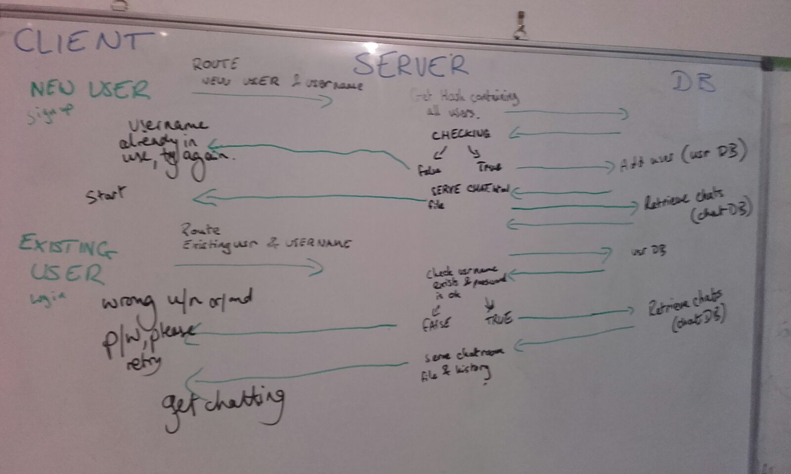

# sockInit

## What?
sockInit provides live, real-time chat in a friendly and open environment. To join the room, simply enter or re-enter your unique username of choice.

## How?
sockInit stores the usernames in a set of redis hashes. Real-time chatting is enabled through use of sockets.

## Stretch Goals
Functionality to store usernames, passwords, number of visits and number of messages has been included on the back-end to spice up the user's experience in the future.

## Wireframe

## This Is Our Flow

## References

* Stackoverflow [discussion](http://stackoverflow.com/questions/6196647/want-to-store-in-redis-via-node-js) on using Redis with Node.
